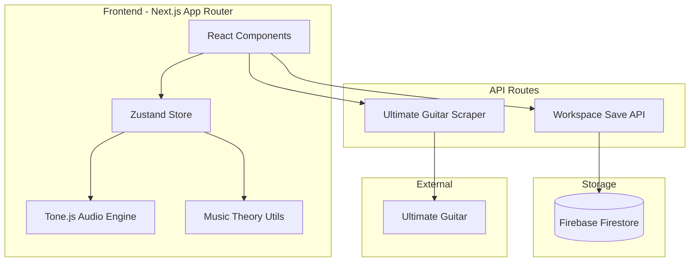
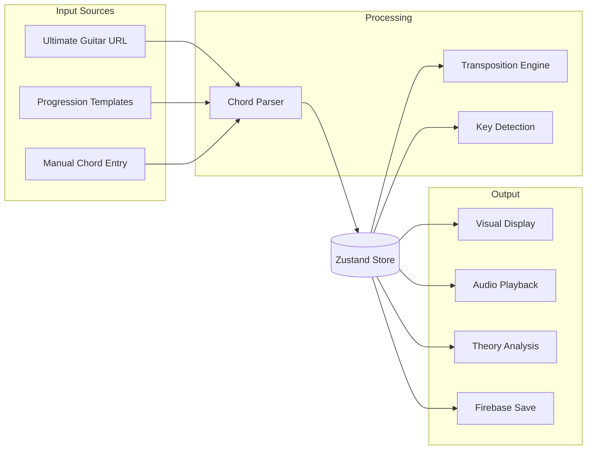

# Chord Shift

A modern web application for scraping chords from Ultimate Guitar, transposing them, arranging chord progressions, and practicing with audio playback.

## Tech Stack

| Category | Technology | Version |
|----------|------------|---------|
| Runtime | [Bun](https://bun.sh) | 1.x |
| Framework | [Next.js](https://nextjs.org) (App Router) | 16.x |
| UI | [React](https://react.dev) | 19.x |
| Styling | [Tailwind CSS](https://tailwindcss.com) + [shadcn/ui](https://ui.shadcn.com) | 4.x |
| State | [Zustand](https://zustand.docs.pmnd.rs) | 5.x |
| Drag & Drop | [@dnd-kit](https://dndkit.com) | 6.x / 10.x |
| Audio | [Tone.js](https://tonejs.github.io) | 15.x |
| Database | Firebase Firestore | 11.x |
| Testing | Bun Test Runner | built-in |
| Deployment | [Vercel](https://vercel.com) | Bun Runtime |

## Architecture



## Data Flow



## Features

### Core Features
- **Import from Ultimate Guitar** - Scrape chord data from any UG chord page
- **Build Custom Progressions** - Create chord builders with drag-and-drop reordering
- **Save & Share** - Persist workspaces to Firebase and share via URL

### Music Theory
- **Key Detection** - Automatic detection of likely key(s) from your progression
- **Roman Numeral Analysis** - See chords as I, IV, V, vi, etc.
- **Chord Functions** - Visualize tonic/subdominant/dominant relationships
- **Color by Function** - Toggle to color chords by their harmonic function

### Transposition
- **Per-Builder Transpose** - Transpose individual builders up/down
- **Global Transpose** - Transpose all builders at once
- **Semitone Controls** - Fine-grained control with +/- buttons

### Audio Playback
- **Play Individual Chords** - Click to hear any chord
- **Practice Mode** - Play through progressions with configurable tempo
- **BPM Control** - Adjustable tempo from 40-200 BPM
- **Beats Per Chord** - Configure how long each chord plays

### Templates
- **10 Built-in Templates** - Pop, Jazz, Blues, Rock, Classical, and more
- **Common Progressions** - I-vi-IV-V, ii-V-I, 12-Bar Blues, etc.
- **One-Click Load** - Instantly load any template

### Instrument Visualization
- **Guitar Chord Diagrams** - SVG diagrams showing finger positions
- **Open & Barre Chords** - Visual indicators for chord shapes

### UI/UX
- **Drag & Drop** - Reorder builders and chords freely
- **Dark Mode** - Elegant dark theme with glassmorphism
- **Responsive** - Works on desktop and tablet
- **Inline Editing** - Click to rename builders

## Getting Started
### Tailwind v4 Notes

Tailwind v4 is configured using CSS-first syntax in `src/styles/globals.css`:
- `@import "tailwindcss";`
- `@theme` for design tokens
- `@utility` for custom utilities
- `@custom-variant dark` for class-based dark mode

### Prerequisites

- [Bun](https://bun.sh) 1.0 or later

### Installation

```bash
bun install
```

### Development

```bash
bun run dev
```

Open [http://localhost:3000](http://localhost:3000) in your browser.

### Build

```bash
bun run build
```

### Testing

```bash
bun test
```

### Linting

```bash
bun run lint
bun run lint:fix  # Auto-fix issues
```

## Project Structure

```
src/
├── app/                    # Next.js App Router pages
│   ├── api/               # API route handlers
│   │   ├── get-ultimate-guitar-chords/
│   │   └── workspace-save/
│   ├── chords/            # Main workspace page
│   ├── layout.tsx         # Root layout
│   └── page.tsx           # Home page
├── components/            # React components
│   ├── ui/               # shadcn/ui components
│   ├── chord-builder.tsx
│   ├── chords-workshop.tsx
│   ├── guitar-chord-diagram.tsx
│   ├── key-display.tsx
│   ├── practice-mode.tsx
│   ├── sortable-builder.tsx
│   ├── sortable-chord-card.tsx
│   ├── templates-modal.tsx
│   ├── transpose-modal.tsx
│   └── ultimate-input-modal.tsx
├── features/              # Business logic
│   ├── construct-workspace.ts
│   ├── generate-chord-info.ts
│   └── music-theory.ts    # Key detection, Roman numerals, templates
├── lib/                   # Shared utilities
├── services/              # External integrations
│   ├── audio-service.ts   # Tone.js wrapper
│   ├── firebase-service.ts
│   └── ultimate-guitar-service.ts
├── store/                 # State management
│   └── workspace-store.ts
├── styles/                # Global CSS
└── types/                 # TypeScript types
```

## Environment Variables

Create a `.env.local` file with your Firebase configuration:

```env
FIREBASE_API_KEY=your_api_key
FIREBASE_AUTH_DOMAIN=your_auth_domain
FIREBASE_PROJECT_ID=your_project_id
FIREBASE_STORAGE_BUCKET=your_storage_bucket
FIREBASE_MESSAGING_SENDER_ID=your_messaging_sender_id
FIREBASE_APP_ID=your_app_id
```

## Future Ideas

These features are not yet implemented but are on the roadmap:

### Audio & MIDI
- [ ] MIDI export for DAW import
- [ ] MIDI keyboard input
- [ ] Strum patterns for guitar playback
- [ ] Metronome with measure counting

### Collaboration
- [ ] Real-time collaboration (like Figma)
- [ ] User accounts with saved workspaces
- [ ] Public gallery of progressions
- [ ] Comments and annotations

### Advanced Theory
- [ ] AI chord suggestions based on style
- [ ] Modulation helper for key changes
- [ ] Voice leading optimizer
- [ ] Borrowed chord detection

### Export & Import
- [ ] PDF chord sheet generation
- [ ] ChordPro format support
- [ ] MusicXML export
- [ ] Spotify integration

### Mobile
- [ ] Progressive Web App (PWA)
- [ ] Offline support
- [ ] Touch-optimized gestures

## AI Agent Guidelines

See [AGENTS.md](AGENTS.md) for coding conventions and LLM instructions.

## Deployment

This project is configured for deployment on Vercel with the Bun runtime:

```json
{
  "bunVersion": "1.x"
}
```

## License

MIT
